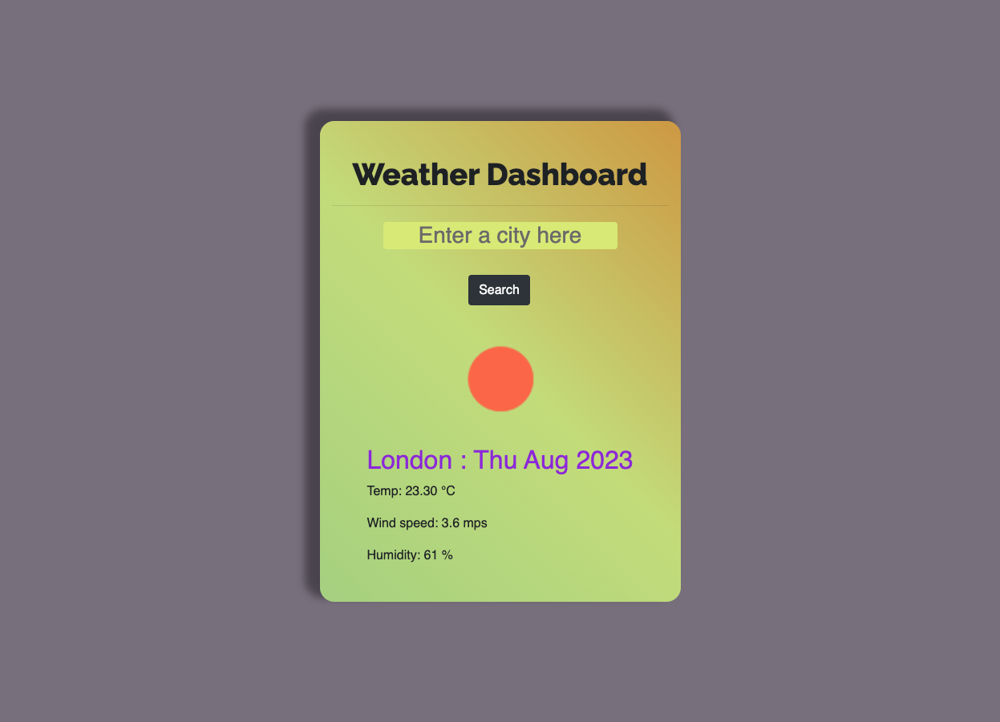

# Weather-Forecast-Dashboard
Weather Dashboard.

## Description
Weather Dashboard is  a web application featuring a search input for all cities around the world.
Currently, the application will only show the current weather from the users input.
You can test the current weather application [here](https://chriscds.github.io/Weather-Forecast-Dashboard/index.html)
## Built with
* HTML5
* CSS
* JavaScript ES6
* JQuery

## Screenshot

## License

Please refer to the LICENSE in the repository.